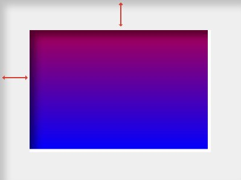

## **Assignment: Photo Products Gallery**

We expect candidates to show us their skills in building robust, testable and maintainable software keeping in mind modern design and architecture principles and industry standard best practices. We value simplicity, readability and pragmatism over unnecessarily performant or complex solutions.

## Task
Your task is to build an image gallery system for **photo products**. A Photo product is any product sold by Albelli-Photobox. The application should display all the products provided and render the products with their extra properties. 

## Data structure
A **photo product** is represented by an object with an image URL, order count, category and some extra properties. Extra properties are `texture`, `border`, `rotate`. 
```json
{
  id: "image_4",
  orderCount: 7411,
  category: "walldecor",
  extra: {
    texture: "glossy",
    border: 5,
    rotate: 90,
  },
},
```

`texture` is a string of the type of material the product is printed on

`border` is a number which represents the width of a border around the image

`rotate` is a number which represents the degrees the source image of a product has been rotated. Photo products rotate from the center.


### **Backend Component**

Design and implement a serverless backend API using AWS technologies and NodeJS. Photo product extras are served from the following URL https://k06fotu2c3.execute-api.eu-west-1.amazonaws.com/.

The backend should have the following features:

1. Design an architecture diagram of the API, showing the components involved and how they interact with each other. Use any standard diagramming tool or framework of your choice.
2. Implement a GET endpoint in the backend API that accepts filter and sort arguments as parameters.
   - Filters:
     - Border (boolean)
     - Texture (e.g., canvas, glossy, not applied)
   - Sorting:
     - Category (ascending/descending alphabetically)
     - Number of orders (ascending/descending)
3. The endpoint should retrieve data from a chosen data store based on the filter and sort criteria provided in the request
4. Return the filtered and sorted data as a JSON response.
5. Leverage AWS serverless technologies for the implementation.

### **Frontend Component**

Create a web application that allows users to browse a range of photo products. The application should have the following features:

1. The frontend application should be built using any framework of your choice (e.g., React, Angular, Vue.js, Vanilla JS). You're free to design this application as long as it has an intuitive user interface.
2. The application should make an HTTP request to the backend component to fetch data of photo products.
3. The application should display a gallery of photo products without rendering their extra properties. `./images/` contains all the images needed. Image ids in the data represents an image from this folder. Displaying these photo product as a grid of small squares is fine. Feel free to implement your own design.
4. The application should support filtering and sorting of the images through the API. Design an interface that makes it easy for a user to 
     - Sort by category or number of orders
     - Filter by border and/or texture
5. On click of a photo product from the gallery, the application should open an overlay which renders the selected photo product with all of its extra properties. Render the extra properties of a photo product according to these rules:
   - Texture: A texture makes the rendered photo product look more like it's physical representation. To do this you need to blend a texture image on to the photo product. Texture images can be found in `./images/textures`. For example it should look something like this:

      | Original image | Texture | Image after Texture
      |----------------|---------|--------------------
      ||
   - Border: Borders are a white area placed around the photo product. The image's size remains the same, the border is rendered around it increasing the size of the photo product.
  
     
   - Rotate: Rotates the image with given number in **degrees** from the center.


      | Original image | Image after rotating 90°
      |----------------|---------------------
      |

### **Instructions**

1. Implement the frontend and backend components of the assignment.
3. Provide documentation in the repository with instructions on how to run and test the application.
4. Share your repository URL or the zipped artifacts with us when you are done.

### **What We Value**

Your assignment will be evaluated based on the following values:

- Your backend design and implementation is more valuable to us than the frontend part
- **Functionality**: Does the application meet the requirements outlined above? Does the frontend display images and their properties correctly? Does the backend provide the expected filtering and sorting capabilities?
- **Code Quality**: Is the code well-structured, maintainable, and adheres to best practices? Are appropriate frameworks and libraries utilized effectively?
- **Backend Architecture**: Is the architecture diagram clear and well-designed? Does it demonstrate an understanding of serverless technologies and AWS services?
- **Documentation**: Are clear instructions provided for running and testing the application?