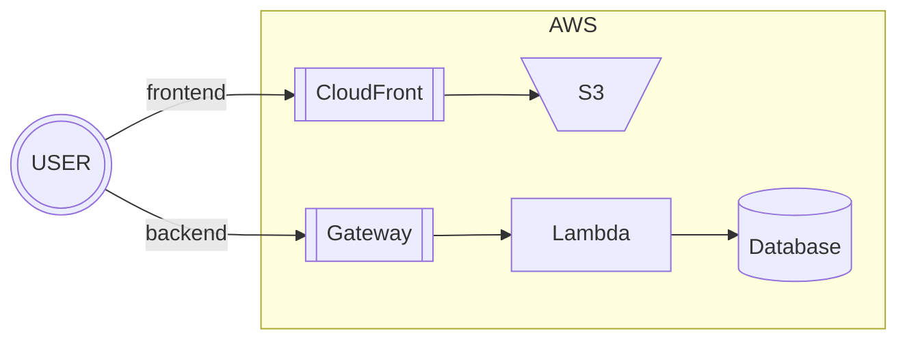
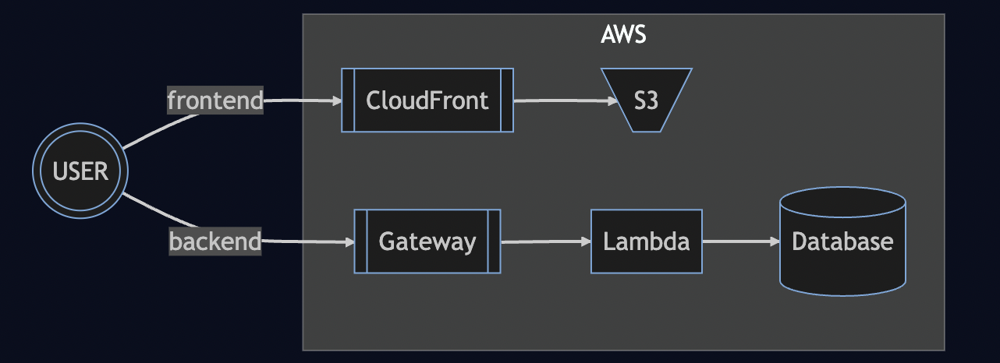
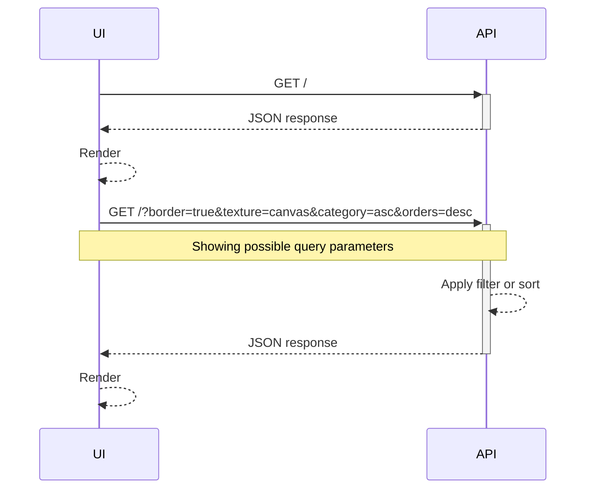
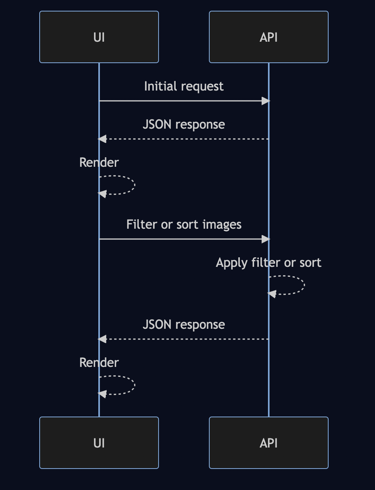

# Architecture

This is a flowchart that shows an overview of the AWS infrastructure that will be deployed:

This sequence diagram shows the interactions between the UI and API components.

## Notes

- When the UI renders API responses, the images are stored on the client.
- The API accepts query parameters with default values border (false), texture (none), category (ascending) and orders (ascending).
- I will use a NoSQL document store (Mongo) because it matches the response structure.
