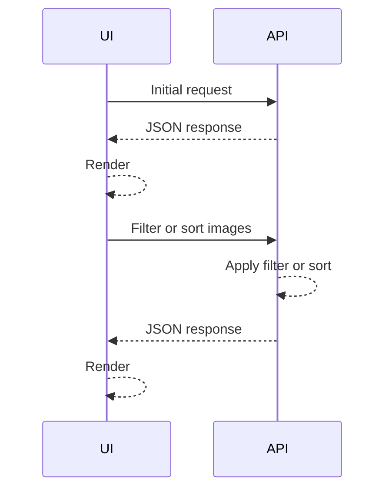

# Architecture

Sequence diagram showing the interactions between frontend and backend components.

```mermaid
sequenceDiagram
    UI->>API: Initial request
    API-->>UI: JSON response
    UI-->>UI: Render
    UI->>API: Filter or sort images
    API-->>API: Apply filter or sort
    API-->>UI: JSON response
    UI-->>UI: Render
```
